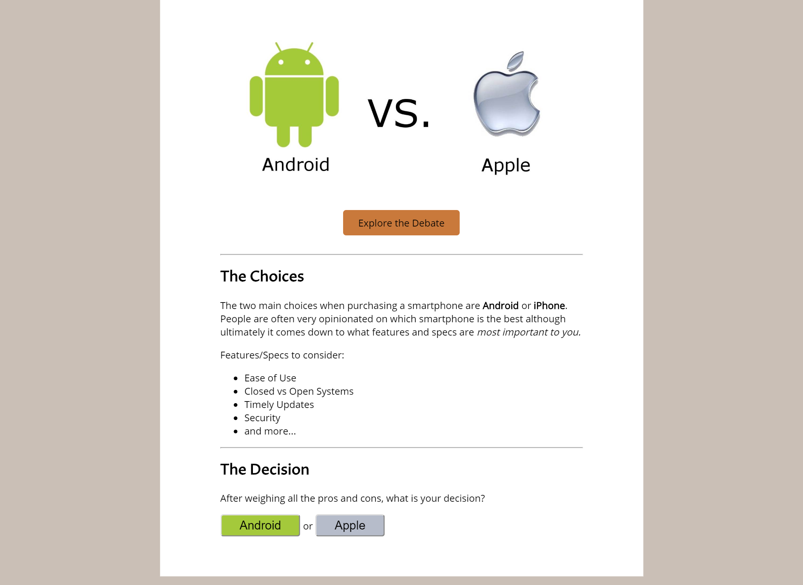

# js-android-vs-apple
Start Code and Instructions for JS Android vs Apple Assignment

Make the Android vs Apple web page interactive by completing the following...

If the user clicks the Android button:

<ul>
  <li>Change the 'Android vs Apple' image to the Android Logo in the images folder</li>
  <li>Change the 'Explore the Debate' link so that the link says 'Android Home'</li>
  <li>Change the 'Explore the Debate' link so that the background color is #a4c93b</li>
  <li>Change the 'Explore the Debate' link so that the href is now 'https://www.android.com/'</li>
  <li>Change the background color of the body to #a4c93b</li>
</ul>

If the user clicks the Apple button:

<ul>
  <li>Change the 'Android vs Apple' image to the Apple Logo in the images folder</li>
  <li>Change the 'Explore the Debate' link so that the link says 'Apple Home'</li>
  <li>Change the 'Explore the Debate' link so that the background color is #b6bcca</li>
  <li>Change the 'Explore the Debate' link so that the href is now 'https://www.apple.com/'</li>
  <li>Change the background color of the body to #b6bcca</li>
</ul>

